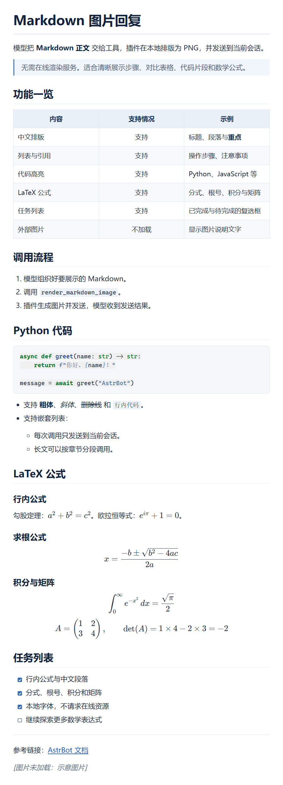
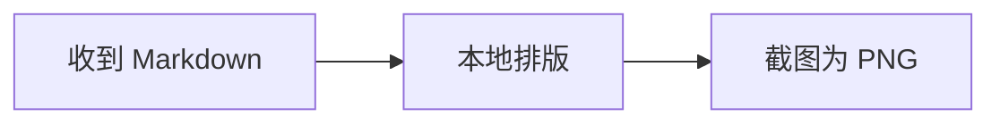
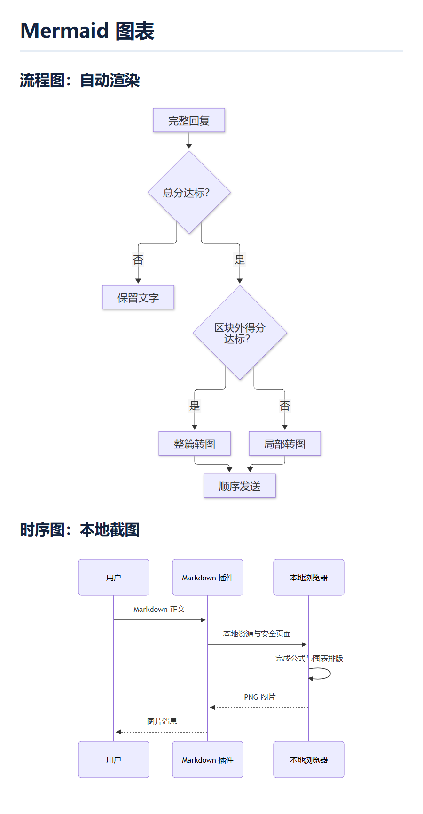

# Markdown 渲染

AstrBot 插件，将 Markdown 在本机排版并截图为 PNG，发送到当前会话。支持**普通 Markdown、代码高亮、LaTeX 公式、Mermaid 图表和任务列表**，正文不发送到在线渲染服务。

提供三个独立开关：**自动渲染默认开启**，**模型工具和提示词注入默认关闭**。

> [!IMPORTANT]
>
> 本插件的图片渲染依赖于 [浏览器服务]([rytte/astrbot_plugin_browser](https://github.com/rytte/astrbot_plugin_browser)) 插件。
>
> * `浏览器服务` 插件负责统一启动一个本地无头 Chromium，并为每次渲染提供独立的页面会话。
>* 避免每个依赖浏览器渲染的插件重复配置，重复启动浏览器、减少内存占用，同时保持离线渲染和任务隔离。

## 安装与快速开始

要求 AstrBot **>=4.27,<5**、Python **3.12+**，以及支持图片消息的平台适配器。已针对本地 AstrBot 4.27.4 验证接口。

1. 安装并启用上方的**浏览器服务**插件。
2. 安装本插件；通过 AstrBot 正常安装时，Python 依赖由 `requirements.txt` 自动安装。
3. 默认开启自动渲染，完整模型回复达到评分阈值后会自动转图；无需模型调用工具。
4. 若需要让模型主动发图，开启 `enable_tool`，并在当前配置/人格的工具选择中启用 `render_markdown_image`。

**KaTeX、Mermaid 的脚本、样式和公式字体随插件内置**，不需要另装 Node.js、npm 或其他公式/图表插件，运行时不请求 CDN。内置前端资源约 6 MB，版本与许可证见 [资源说明](./assets/README.md)。

中文正文使用系统字体，优先 Noto Sans CJK SC、微软雅黑、苹方。容器中中文显示为方框时，请安装中文字体；公式字体无需另外安装。

## 渲染示例



[查看主示例 Markdown 源码](./examples/demo.md)

### LaTeX 公式与任务列表

支持行内 `$...$`、`\(...\)`，以及独立的块级 `$$...$$`、`\[...\]`。单美元公式的定界符内侧不要留空格；转义的 `\$`、普通货币金额与代码里的公式不会被当作数学公式。

```markdown
勾股定理：$a^2 + b^2 = c^2$。

$$
x = \frac{-b \pm \sqrt{b^2 - 4ac}}{2a}
$$

- [ ] 待完成
- [x] 已完成
```

使用 KaTeX 排版常用数学表达式，不是完整 LaTeX 文档编译器。任务列表支持 `[ ]`、`[x]` 和 `[X]`，复选框仅展示状态，不支持点击修改。

### Mermaid 图表

使用标记为 `mermaid` 的围栏代码块，支持流程图、时序图等 Mermaid 内置图表类型。

````markdown

````

图表固定使用严格安全模式，不执行点击回调、不加载外部资源；**不接受 YAML 配置头或 `%%{...}%%` 配置指令**，遇到这些配置会明确报错。需要调整图表时，请直接修改图表结构。



[查看示例 Markdown 源码](./examples/mermaid.md)

## 自动渲染

`enable_auto_render` 默认开启，在 AstrBot 发送**完整模型文字回复**前检测结构。默认评分阈值 `auto_threshold=6`，处理规则如下：

1. **总分低于阈值**：保留文字。
2. **总分达到阈值**：找出可独立渲染的表格、多行代码块、块级公式和 Mermaid 图表，计算这些区块之外的得分。
3. **区块外低于阈值**：仅把目标区块转成图片，保留其余文字及原始 Markdown 标记，按原顺序发送。
4. **区块外也达到阈值，或没有独立区块**：整篇转图。

例如“普通说明 → 公式 → 普通说明 → 图表 → 结尾”，会发送成“文字 → 公式图片 → 文字 → 图表图片 → 文字”。多个区块各自生成图片；**行内公式也计分，但不会从句子中单独拆出**。嵌套在列表、引用里的区块不会被单独抽离，以免丢失上下文。

所有目标区块渲染成功后才替换消息。超限、语法错误、超时或浏览器异常时，保留整条原始回复，不截断、不发送已生成的部分图片，也不转向在线服务。平台发送故障由 AstrBot 处理，插件不自动重试。

### 评分规则

检测与渲染共用相同的 Markdown 解析配置，按语法结构计分，而非统计符号；代码内容不会再次作为 Markdown 计分。各类别分别封顶：

| 结构 | 得分 | 类别上限 |
| --- | --- | --- |
| 表格 | 每个 6 | 6 |
| LaTeX 公式（行内、块级） | 每个非空公式 6 | 6 |
| Mermaid 图表 | 每个非空图表 6 | 6 |
| 普通代码块 | 至少两行非空内容 6；单行 2；空块 0 | 6 |
| 标题 | 每个 2 | 6 |
| 列表项（含任务列表） | 每项 1 | 6 |
| 引用块 | 每块 2 | 4 |
| 加粗、斜体、删除线 | 每处 1 | 2 |
| 行内代码、链接 | 每处 1 | 2 |
| 分隔线 | 每个 1 | 1 |

公式与 Mermaid **各自**最多计 6 分，不占普通代码块的评分额度。计算区块外得分时，会排除整个目标区块及内部的其他格式，再分别应用上限。

评分是启发式规则，不代表准确率，也不额外请求模型判断。默认情况下，单个公式或图表即可达到阈值；简短加粗、链接、短列表通常保留文字。普通编号步骤与 Markdown 列表语法相同，长列表仍可能触发；调高阈值可减少自动转图。

### 适用范围

- 只处理标为 `LLM_RESULT` 的完整文字回复；用户消息、普通命令结果、工具消息及流式片段不处理。
- 标准 AstrBot 聊天链路中会关闭**本轮事件**的流式输出，等待完整回复，不修改全局设置。Live Mode 或不遵循事件设置的第三方 Agent Runner 不保证自动转换。
- 已有图片、语音等混合媒体消息保持原消息链。正文前后的 @ 与引用保留；@ 穿插在文字段之间时不转换。
- 自动模式处理的模型回复会禁用后续 AstrBot 内置转图，避免重复转换或失败后转向在线服务。

## 模型工具

`enable_tool=true` 时提供 `render_markdown_image`，模型需要支持工具调用，并在当前配置/人格中选中该工具。可以对机器人说：“把以下内容整理成 Markdown，再用图片发给我。”

工具只有一个 `markdown` 字符串参数，传完整正文，不要再用一层代码围栏包住整篇文章：

```json
{
  "markdown": "# 今日计划\n\n- [x] 阅读\n- [ ] 编程\n\n勾股定理：$a^2+b^2=c^2$。"
}
```

成功返回 `{"ok": true, "sent_images": 1, ...}`，表示平台发送接口已完成；失败返回 `ok: false`、`stage` 和错误说明。发送报错时平台可能已收到图片，插件不会自动重试。

模型工具与自动渲染互不依赖。工具本轮成功发图后，后续普通文字和补充说明不再自动转图，也不交给 AstrBot 内置转图；显式的后续工具调用仍可按章节继续发图。防重复标记仅属于当前事件，不影响其他会话或下一轮。

## 提示词注入

`enable_tool_prompt` 默认关闭，独立于模型工具和自动渲染。开启后，仅当 `tool_prompt` 去除首尾空白后非空，才把内容追加到当前模型请求的原系统提示词后。

- 空白提示词不注入，也不回退默认值。
- 不覆盖原系统提示词，不修改已保存的人格配置。
- 不检查工具列表，也不注册或启用工具；若提示词要求使用 `render_markdown_image`，仍需另外启用工具。
- 不保证模型调用工具；参数、渲染限制及成功后不重复输出全文的要求仍在固定工具描述中。

## 配置

在 AstrBot 插件配置页修改并保存。浏览器路径与并发会话数统一在 `astrbot_plugin_browser` 中配置，模型不能通过工具参数指定浏览器路径。

| 配置 | 默认值 | 说明 |
| --- | --- | --- |
| `enable_auto_render` | `true` | 自动检测并转换完整模型文字回复 |
| `auto_threshold` | `6` | 整篇及区块外评分共用的阈值，整数 1～30 |
| `enable_tool` | `false` | 向模型提供 `render_markdown_image` |
| `enable_tool_prompt` | `false` | 追加非空的自定义系统提示词 |
| `tool_prompt` | 内置工具使用偏好提示词 | 需开启提示词注入；空白时不注入、不回退 |
| `width` | `900` | 图片宽度，整数 480～1600 像素 |
| `font_size` | `22` | 正文字号，整数 14～32 像素 |

## 排版、安全与限制

- 支持中文、标题、段落、粗体/斜体/删除线、列表、引用、分隔线、链接、表格、行内代码、围栏代码高亮，以及前述公式、图表和任务列表。未知代码语言按普通代码显示。
- 每次最多 **20000 字符**；图片最大高度 **12000 像素**、面积 **1200 万像素**。工具模式超限返回明确错误，由模型分段调用；自动模式保留原文，不截断正文。
- 代码长行与表格内容自动换行；极宽的多列表格建议拆分。
- 原始 HTML 按文本展示，外部图片显示说明文字；不执行模型提供的 HTML、JavaScript 或原始 CSS，不访问链接目标。
- 普通 Markdown 页面禁用脚本；公式和图表页面仅允许带随机 CSP nonce 的**插件内置脚本**。公式禁止可信 HTML/外部资源命令，Mermaid 使用严格安全模式；所有会话禁用服务工作线程并阻止外部资源请求。
- 同时处理一个渲染任务，最多容纳 **4 个运行中/排队任务**。排队和渲染共用 **45 秒**超时，自动模式多个区块合计也限制为 45 秒。
- 每次会话在成功、失败或取消后释放。插件卸载取消自己的待处理任务，不关闭其他插件共用的浏览器。图片在内存中交给 AstrBot；平台适配器仍可能按自身机制缓存图片。

## 本地预览与测试

在插件目录的**父目录**执行；需要可导入 AstrBot 及浏览器服务插件，但不需要启动 AstrBot，也不会发送聊天消息。预览命令自行启动并关闭本地浏览器：

```bash
python -m astrbot_plugin_markdown_render.preview astrbot_plugin_markdown_render/examples/demo.md astrbot_plugin_markdown_render/demo.png
python -m astrbot_plugin_markdown_render.preview astrbot_plugin_markdown_render/examples/mermaid.md astrbot_plugin_markdown_render/examples/mermaid.png
```

在本工作区的父目录，可以使用已有 AstrBot 虚拟环境测试：

```powershell
./AstrBot/.venv/Scripts/python.exe -m pytest astrbot_plugin_markdown_render/tests -q
ruff check astrbot_plugin_markdown_render
ruff format --check astrbot_plugin_markdown_render
```

设置 `ASTRBOT_BROWSER_EXECUTABLE` 为 Chromium 或 Edge 的绝对路径，可额外运行真实浏览器集成测试；未设置时跳过这些测试。测试依赖 `pytest`、`pytest-asyncio`、Pillow，框架集成测试需要可导入 AstrBot。测试使用临时 `ASTRBOT_ROOT`，不修改实际机器人数据，覆盖评分、局部转图顺序、失败保留原文、资源释放、公式/图表排版、离线字体及安全边界。
