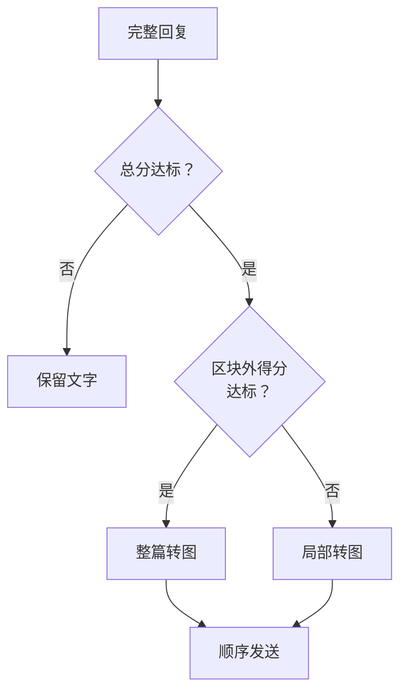
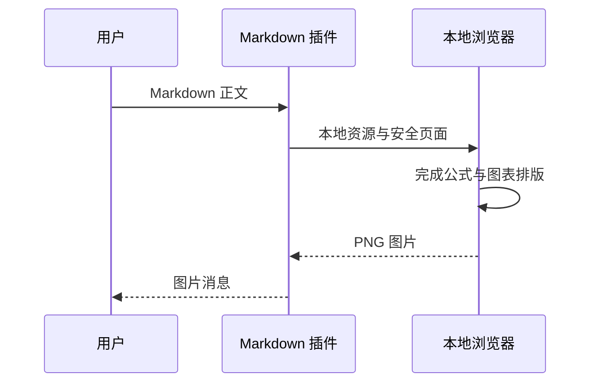

# Mermaid 图表

## 流程图：自动渲染

```mermaid
flowchart TD
    A[完整回复] --> B{总分达标？}
    B -- 否 --> C[保留文字]
    B -- 是 --> D{区块外得分<br/>达标？}
    D -- 是 --> E[整篇转图]
    D -- 否 --> F[局部转图]
    E --> G[顺序发送]
    F --> G
```

## 时序图：本地截图

```mermaid
sequenceDiagram
    participant U as 用户
    participant P as Markdown 插件
    participant B as 本地浏览器
    U->>P: Markdown 正文
    P->>B: 本地资源与安全页面
    B->>B: 完成公式与图表排版
    B-->>P: PNG 图片
    P-->>U: 图片消息
```
